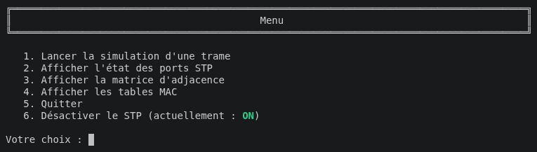
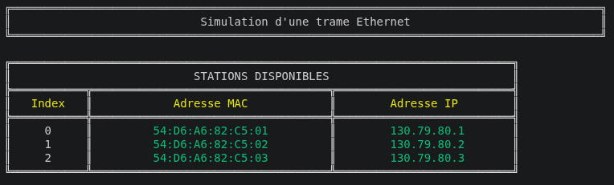
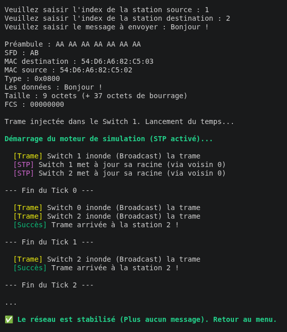
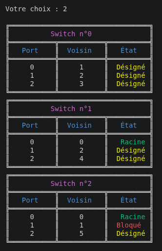
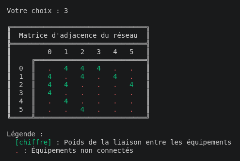
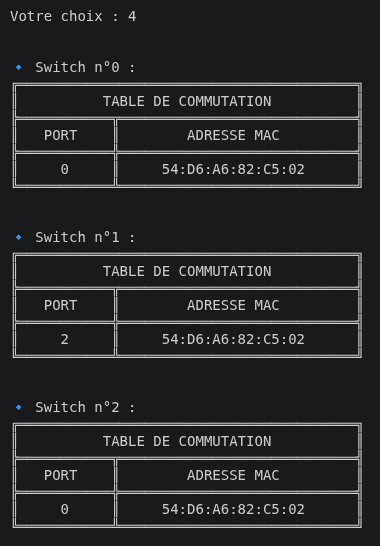
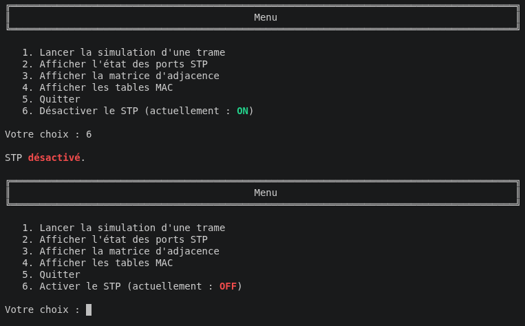

<!-- |-------------------------------------------------------------------------------------------| -->
<!-- |                                         LANGUAGE                                          | -->
<!-- |-------------------------------------------------------------------------------------------| -->
<div align="right">
  <a href="README.fr.md">
    
  </a>
  <a href="README.en.md">
    
  </a>
</div>

<!-- |-------------------------------------------------------------------------------------------| -->
<!-- |                                          HEADER                                           | -->
<!-- |-------------------------------------------------------------------------------------------| -->
<h1 align="left">🌐 Simulateur réseau STP</h1>

<p align="left">
  Un simulateur de réseau local en C implémentant le protocole STP (Spanning Tree Protocol) et la commutation Ethernet, avec simulation de propagation de trames.
</p>

<!-- |-------------------------------------------------------------------------------------------| -->
<!-- |                                       À PROPOS                                            | -->
<!-- |-------------------------------------------------------------------------------------------| -->
## À propos du projet

Ce simulateur permet de modéliser et de simuler le comportement d'un réseau local composé de stations et de commutateurs. Il a été réalisé dans le cadre d'un projet à l'IUT Robert Schuman.

[](https://www.cprogramming.com/)

Le simulateur implémente :
- Le protocole **STP** pour éviter les boucles réseau par échange de BPDU
- La **commutation Ethernet** avec apprentissage automatique des adresses MAC
- La **propagation de trames** entre stations via les commutateurs
- L'affichage des **tables de commutation** et de l'**état des ports STP**
- La possibilité d'**activer ou désactiver le STP** en temps réel

<!-- |-------------------------------------------------------------------------------------------| -->
<!-- |                                        APERÇU                                             | -->
<!-- |-------------------------------------------------------------------------------------------| -->
## 📸 Aperçu


**Menu principal** : Interface de démarrage du simulateur avec les 6 options disponibles.

<div align="center">

</div>
<br>

**Stations disponibles** : Liste des stations du réseau avec leur adresse MAC et IP.

<div align="center">

</div>
<br>

**Simulation d'une trame** : Propagation tick par tick d'une trame Ethernet dans le réseau.

<div align="center">

</div>
<br>

**État des ports STP** : Affichage de l'état de chaque port après convergence du protocole STP.

<div align="center">

</div>
<br>

**Matrice d'adjacence** : Visualisation de la topologie du réseau et des coûts des liens.

<div align="center">

</div>
<br>

**Tables de commutation** : Tables MAC apprises dynamiquement par chaque switch.

<div align="center">

</div>
<br>

**STP désactivé** : Tous les ports passent en état désigné, les boucles ne sont plus gérées.

<div align="center">

</div>
<br>

<!-- |-------------------------------------------------------------------------------------------| -->
<!-- |                                      INSTALLATION                                         | -->
<!-- |-------------------------------------------------------------------------------------------| -->
## ⚙️ Installation

### Prérequis

- **GCC** (GNU Compiler Collection)
- **Make**
- Un terminal compatible avec les codes couleurs ANSI

### Compilation

&nbsp; &nbsp; **1. Clonez le dépôt**
```sh
git clone https://github.com/rmax3iu/STP-network-simulator.git
cd STP-network-simulator
```

&nbsp; &nbsp; **2. Compilez le projet**
```sh
make
```

&nbsp; &nbsp; **3. Lancez le simulateur**
```sh
./bin/sae23
```

<!-- |-------------------------------------------------------------------------------------------| -->
<!-- |                                       UTILISATION                                         | -->
<!-- |-------------------------------------------------------------------------------------------| -->
## 🚀 Utilisation

Au lancement, le simulateur demande un fichier de configuration. Des exemples sont disponibles dans le dossier `configs/`.

```sh
Veuillez saisir le nom du fichier : configs/config2.txt
```

| Option | Description |
|--------|-------------|
| 1 | Lancer la simulation d'une trame Ethernet |
| 2 | Afficher l'état des ports STP |
| 3 | Afficher la matrice d'adjacence |
| 4 | Afficher les tables MAC |
| 5 | Quitter |
| 6 | Activer / Désactiver le STP |

<!-- |-------------------------------------------------------------------------------------------| -->
<!-- |                                      PROTOCOLE STP                                        | -->
<!-- |-------------------------------------------------------------------------------------------| -->
## 🌳 Protocole STP

Le STP (Spanning Tree Protocol) évite les boucles réseau en attribuant un état à chaque port de chaque switch :

| État | Description |
|------|-------------|
|  | Port avec le meilleur chemin vers le root bridge |
|  | Port ouvert, transmet les trames normalement |
|  | Port fermé pour couper les boucles |

Le **root bridge** est élu automatiquement : c'est le switch avec la plus petite adresse MAC.

<!-- |-------------------------------------------------------------------------------------------| -->
<!-- |                                   FORMAT DE CONFIG                                        | -->
<!-- |-------------------------------------------------------------------------------------------| -->
## 📄 Format des fichiers de configuration

```
<nb_équipements> <nb_liens>
2;<MAC>;<nb_ports>;<priorité>     (switch)
1;<MAC>;<IP>                      (station)
<idx_a>;<idx_b>;<coût>            (lien)
```

### 💡 Exemple

```
4 3
2;01:45:23:a6:f7:ab;8;1024
1;54:d6:a6:82:c5:23;130.79.80.21
1;c8:69:72:5e:43:af;130.79.80.27
1;77:ac:d6:82:12:23;130.79.80.42
0;1;4
0;2;19
0;3;4
```

| Débit  | Coût STP |
|--------|----------|
| 10 Mb/s  | 100 |
| 100 Mb/s  | 19 |
| 1 Gb/s  | 4 |

<!-- |-------------------------------------------------------------------------------------------| -->
<!-- |                                    STRUCTURE DU PROJET                                    | --> 
<!-- |-------------------------------------------------------------------------------------------| -->
## 📁 Structure du projet

```
STP-network-simulator/
├── src/
│   ├── main.c          # Point d'entrée et menu
│   ├── stp.c / stp.h   # Protocole STP et ordonnanceur
│   ├── reseau.c / .h   # Structure et gestion du réseau
│   ├── switch.c / .h   # Commutateur et table MAC
│   ├── station.c / .h  # Station (MAC + IP)
│   ├── ethernet.c / .h # Trame Ethernet
│   ├── config.c / .h   # Lecture des fichiers de configuration
│   ├── matrice.c / .h  # Matrice d'adjacence
│   ├── adresse.c / .h  # Types MAC et IPv4
│   └── utils.c / .h    # Fonctions utilitaires
├── configs/            # Fichiers de configuration réseau
├── assets/             # Screenshots
├── docs/               # Documentation et sujet
└── Makefile
```

<!-- |-------------------------------------------------------------------------------------------| -->
<!-- |                                       CONTRIBUTEURS                                       | -->
<!-- |-------------------------------------------------------------------------------------------| -->
## 👥 Contributeurs

Travail réalisé en trinôme dans le cadre d'un projet à l'IUT Robert Schuman.

<div align="center">

[](https://github.com/rmax3iu)
[](https://github.com/lucastreiber)
[](https://github.com/marwaaan212)

</div>
